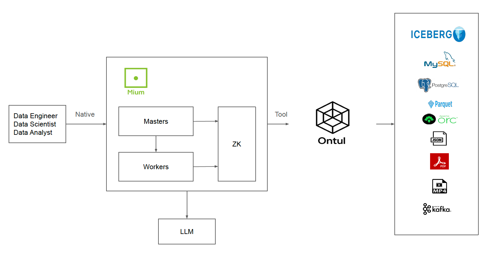

# Architecture

Mium is the **AI Agent Platform for Ontul** — a Java-native, on-prem-first multi-agent platform purpose-built to give users natural-language access to data stored in Ontul. Mium without Ontul is meaningless; every capability — SQL analytics, job lifecycle, code generation — is designed around Ontul as the data engine. Over time Mium may grow into a control plane for the broader CCL stack, but Ontul is and will remain its foundational dependency.

- **Ontul-Native Analytics**: Mium is purpose-built as the AI agent layer for Ontul. Users ask questions in natural language, and Mium's agent orchestrates SQL queries against Ontul to deliver analytical insights — aggregations, trend analysis, filtering, joins, and more.
- **Multi-Agent Orchestration**: Planner/executor/specialist agent patterns with a pluggable LLM backend. The agent understands Ontul's schema and SQL dialect, automatically generating optimized queries for the user's analytical intent.
- **CCL Stack Integration**: IAM, KMS, and connection credentials live in embedded RocksDB on each Master. Chat history, prompt library, and embeddings live in NeorunBase. Server-rendered export files are stored in any S3-compatible object store (ShannonStore, MinIO, AWS S3, etc.).

## Mium Architecture

Mium consists of two main deployable components: **Master** and **Worker**.

### Master

The Master is the central coordination node — handling user sessions, administrative operations, and cluster state management.

- **Admin HTTP Server**: Netty-based HTTP server serving the React Admin UI and REST API endpoints under `/admin/api/*`. JWT authentication (HMAC-SHA256) on all routes except `/health` and `/admin/auth/login`. HA routing: write requests on followers are transparently proxied to the leader.
- **IAM (AuthManager)**: RocksDB-backed singleton IAM store managing users, groups, policies, companies, and organizations. AWS-style JSON policy evaluation with deny-by-default semantics.
- **ConnectionStore**: Per-user encrypted credential vault for tool and LLM connections. Encrypted at rest via KMS envelope encryption (AES-256-GCM).
- **MemoryStore**: Per-user persistent chat history stored in NeorunBase (`mium_chat_session` / `mium_chat_message` tables).
- **PromptStore**: Per-user saved-prompt library stored in NeorunBase (`mium_prompt` table).
- **EmbeddingStore**: Vector store for embedding-based retrieval stored in NeorunBase using `VECTOR(N)` columns.
- **KMS (MiumKmsProvider)**: Built-in envelope encryption service with versioned Key Encryption Keys (KEKs). PBKDF2-SHA256 master key derivation with 200K iterations.
- **AgentLoop**: Multi-action dispatch over a strict-JSON protocol. Actions: `query`, `submit_batch`, `submit_streaming`, `job_status`, `job_logs`, `kill_job`, `list_jobs`, `list_history`, `generate_code`.
- **Admin Endpoints**: Auth, IAM CRUD, connection management, KMS key management, chat session management, server-side export dispatch, temp-file S3 settings, monitoring.

### Worker

The Worker is the execution node that handles LLM calls, tool execution, and server-side file rendering.

- **Tool Execution**: Receives `EXECUTE_TOOL` opcodes from the Master and runs Ontul SQL queries using per-user credentials from the ConnectionStore.
- **LLM Execution**: Receives `EXECUTE_AGENT` opcodes and drives LLM inference via the pluggable LLM backend.
- **Export Rendering**: Receives `EXECUTE_EXPORT` opcodes and runs Python scripts (openpyxl / reportlab / python-pptx) to render XLSX / PDF / PPTX files. The rendered file is envelope-encrypted and uploaded to S3. The Master then serves the download to the user.
- **Metrics Reporting**: Reports CPU, heap, and thread count metrics to the Master via the NIO protocol.
- **Log Tailing**: Streams real-time logs to the Admin UI for observability.
- **Service Registration**: Registers as an ephemeral ZooKeeper node — automatic detection of joins and failures.

### Communication Architecture

Mium uses a custom NIO-based binary protocol for all internal communication between nodes. The wire format carries a length prefix, a correlation id, a 2-byte opcode, and a flags byte before the payload. Opcodes cover cluster control, state synchronization between the leader and followers, agent/tool/export execution dispatch, and observability. The control plane is pure `java.nio` (Selector-based) — no Netty in this layer.

### Cluster Coordination

Mium uses Apache ZooKeeper (via Curator) for:

- **Service Discovery**: Masters and Workers register as ephemeral nodes under `/mium/masters/<nodeId>` and `/mium/workers/<nodeId>`, enabling automatic detection of node joins and failures.
- **Leader Election**: Curator LeaderLatch elects a primary Master. On leader failure, a new leader is automatically elected and reloads persisted state from RocksDB.
- **Cluster Readiness**: The leader sets a `leader-ready` flag in ZK after seeding KMS keys. Non-leader Masters and Workers watch for this flag, then pull KMS + IAM + ConnectionStore from the leader. Each node marks itself `ready=true` in ZK after all three stores are synced. The leader polls ZK and accepts user requests only when every registered node is ready. If any node becomes unready, the leader stops accepting requests until the cluster is whole again.
- **State Replication**: The leader Master replicates IAM, KMS, and ConnectionStore to follower Masters and Workers via NIO sync messages. Memory, Prompt, and Embedding data live in NeorunBase and do not require Mium-side replication.

### LLM Backend Abstraction

Mium decouples from any single LLM vendor through a pluggable `LlmBackend` interface:

- **LlmBackendFactory**: Builds backends from stored connections, so each user can connect their own LLM provider.
- **Strict JSON Protocol**: All LLM interactions use structured JSON replies — no vendor-specific tool APIs.
- **Shipped backends**: `AnthropicLlmBackend` (Anthropic Claude) and `OllamaLlmBackend` (local / self-hosted Ollama). Embedding backends: `OllamaEmbeddingBackend`.

### Ontul Tool Integration

Mium's primary tool is **Ontul SQL** — enabling LLM-driven data analysis against Ontul:

- **Tool SPI**: The `Tool` interface defines how Ontul is exposed to the LLM agent. The Ontul tool provides a `sqlReference()` that the agent loop injects into the LLM system prompt, enabling the LLM to understand Ontul's schema and SQL dialect.
- **Natural Language to SQL**: Users ask analytical questions in natural language. The agent translates these into optimized SQL queries against Ontul.
- **Per-User Credentials**: The Ontul tool uses credentials from the user's ConnectionStore entry. Mium does NOT federate IAM with Ontul — Ontul's own access control decides what data the user can access.

### Data Stores

| Store | Backend | Purpose |
|-------|---------|---------|
| IAM | RocksDB (embedded) | Users, groups, policies, companies, organizations |
| KMS | RocksDB (embedded) | Master key bundle with versioned data encryption keys |
| ConnectionStore | RocksDB (embedded) | Per-user tool/LLM credentials (KMS-encrypted at rest) |
| MemoryStore | NeorunBase | Per-user chat sessions and messages |
| PromptStore | NeorunBase | Per-user saved prompt library |
| EmbeddingStore | NeorunBase (VECTOR) | Vector store for embedding-based retrieval |
| TempFileStore | S3-compatible | Encrypted ciphertext of server-rendered exports |

IAM, KMS, and ConnectionStore live on embedded RocksDB because they bootstrap the cluster itself — they cannot depend on an external database that hasn't started yet. Memory, Prompt, Embedding, and TempFile stores use shared infrastructure (NeorunBase and S3-compatible storage), keeping Masters and Workers stateless for those data types.

### External Dependencies

| Dependency | Required | Purpose |
|------------|----------|---------|
| Ontul | Yes | The data engine Mium exists to serve. Without Ontul, Mium has nothing to query. |
| ZooKeeper | Yes | Leader election, service discovery, cluster readiness |
| NeorunBase | Yes | Memory, Prompt, Embedding storage |
| S3-compatible storage | Yes | Server-rendered export file storage (ShannonStore, MinIO, AWS S3, etc.) |

### Client Interfaces

| Port | Protocol | Purpose |
|------|----------|---------|
| 8090 | HTTP (Netty) | Admin UI, REST API, chat endpoints, monitoring |
| Internal | Custom NIO | Internal cluster communication (Master-Master, Master-Worker) |

### Key Design Principles

1. **Ontul-First** — Mium exists to serve Ontul. Every feature — natural-language SQL, job lifecycle, code generation — is built around Ontul as the data engine. Ontul is a hard dependency, not an optional tool.
2. **Sovereign AI** — All state lives on your infrastructure. Users bring their own LLM API keys. No data leaves your network unless you point the LLM connection at a hosted provider.
3. **LLM-agnostic** — Pluggable backend interface with strict JSON protocol. Switch LLM providers without changing application code.
4. **Worker-centric compute** — LLM calls, tool execution, and file rendering all run on Workers. Masters coordinate but don't do heavy lifting.
5. **Cluster-wide readiness** — The leader accepts requests only when every node has synced its state. If a node drops, the leader re-validates before resuming.
6. **HA by default** — Multi-Master leader election with automatic state replication for IAM, KMS, and ConnectionStore. Write-only-on-leader with transparent proxying.
