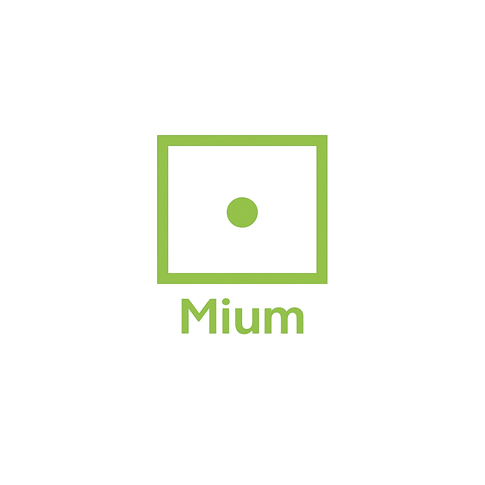

---
hide:
- navigation
- toc
- path
title: " "
---

  

<h2 align="center" style="margin-top: 1.5rem;">Multi-Agent AI Platform for Ontul</h2>

  Mium is the on-prem-first AI agent platform for the CCL stack. Ask a question in plain language and get an answer built from Ontul's certified definitions, with the definitions it used shown beside it. Wrong answers are corrected once by an analyst and stay corrected. IAM, KMS, and per-user credentials live entirely on your infrastructure.

  <a href="./architecture/architecture" style="background: #2563eb; color: white; padding: 14px 40px; border-radius: 8px; text-decoration: none; font-weight: 600; font-size: 1.2rem;">Read the Architecture</a>

